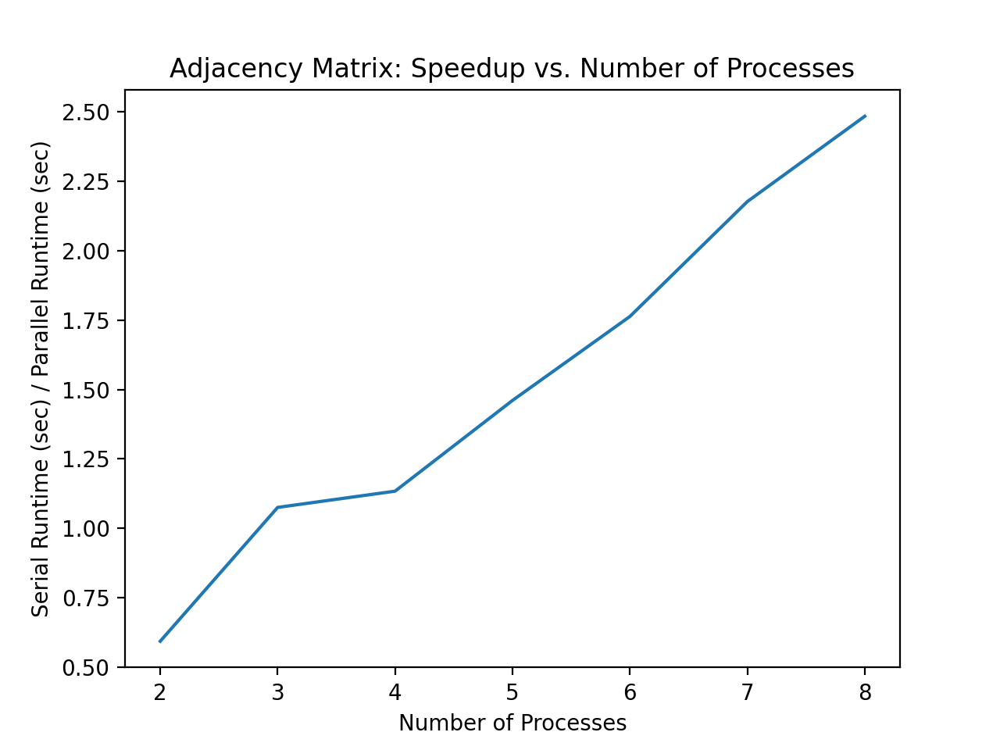

# Adjacency Matrix

An adjacency matrix is a matrix-based graph representation. It stores information about the edges in the graph in an efficient format.  

## Sequential algorithm
Instatiates a matrix of size n x n where n is the number of nodes
For each edge (n1,n2) in the graph: 
1. If graph is directed, set element [n1,n2] to 1
2. If graph is undirected, set elements [n1,n2] and [n2,n1] to 1
3. All other elements are set to 0

If an edge (n1,n2) has a value of 0 in the adjacency matrix, this indicates that no edge exists between those nodes. The time complexity of this algorithm is O(E) where E is the number of edges in the graph, as it traverses all edges and adds them to the adjacency matrix. 

## Parallelization
### Parallelization with MPI
Adjacency matrix creation is a highly sequential task, as the majority of the work is due to file reading. It is a difficult task to parallelize without knowing the file size in advance. For this reason, MPI is assumed to be slower than the sequential version, as must of the work is still done sequentially, with additional communication overhead. However, it is possible to parallelize the distribution of the adjacency matrix among processes once created. 

To parallelize the adjacency matrix distribution, we used MPI. We first read in the file and initialized the matrix, then divided the matrix into p components (where p is the number of processes), and distributed each component to its corresponding process. 

```c++
void distributeAdjacencyMatrix(int rank){
    MPI_Status status;
    if (rank == 0) {
        for (int i = 1; i < size; i++)
            MPI_Send(&A[blocksize*i], blocksize, MPI_INT, i, 1, MPI_COMM_WORLD);
    } else {
        MPI_Recv(&A[offset], blocksize, MPI_INT, 0, 1, MPI_COMM_WORLD, &status);
    }
}
```

### Test Data
We ran adjacency matrix creation on the all.edges file, which contains a list of edges from the Facebook data in the Stanford dataset. The data contains 170,174 edges and is formatted as follows: 

| node 1 | node 2 |
|-----------|------------|
| 98 | 331 |
| 299 | 194 |
| 122 | 141 |
| 84 | 236 |
| 133 | 62 |

The serial runtime for adjacency matrix creation on the all.edges file is 0.04104 seconds.

The speedup was calculated in terms of the adjacency matrix distribution, taking into account the sequential time to communicate p subsets of the matrix, where p is the number of components that are to be distributed. This code was executed on an MPI cluster, with 2-8 tasks on 2 nodes. The speed up table and plot are below:

| Version | Processors (#) | Speed Up |
|------------|---------------------|----------------|
| MPI | 2 | 0.59358254 |
| MPI | 3 | 1.07558444 |
| MPI | 4 | 1.13407759 |
| MPI | 5 | 1.46078934 |
| MPI | 6 | 1.76326531 |
| MPI | 7 | 2.17697385 |
| MPI | 8 | 2.4842615 |

As shown in the table above, the speed up generally increases as the number of processors increases. Note that the speed up is below 1.0 for 2 processes, which is likely due to the communication and synchronization overhead. This demonstrates that MPI was fairly successful at parallelizing the algorithm. We can see in the plot below that generally the speed up increases linearly with the number of processes. 



The plot above shows that we have acheived a speed up that is approximately linear. As we increase the number of processes, we do generally improve performance.
