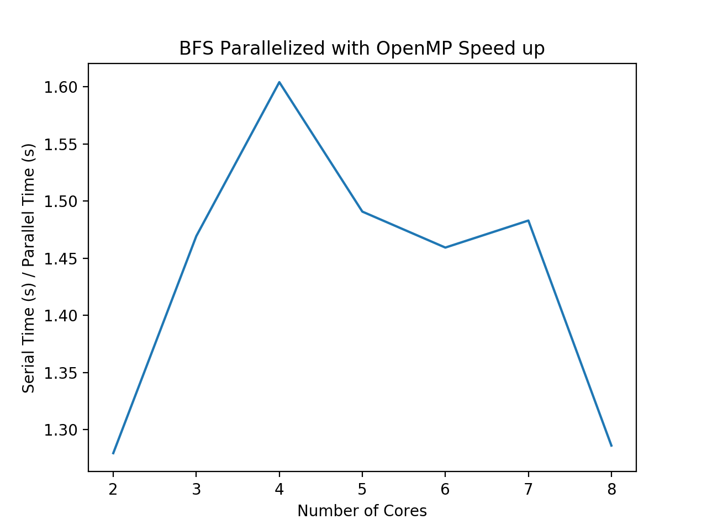

# Breadth First Search

Breadth first search (BFS) is an algorithm that traverses trees or graph data structures. It is useful for finding the shortest path in an unweighted graph data structure. It accomplishes this in an undirected graph (which is what we focus on for this project), by starting at a specified source node, and visits each child node, keeping track of nodes it already visits along the way. This is algorithm can be useful in analyzing large networks. 

## Sequential Algorithm
For a graph, g, and starting node, s, the algorithm is as follows:
1.	Create an array, V, that records with nodes of g have been visited. Mark the entry at node s as visited.
2.	Create a queue, Q, that contains the next nodes to be visited. Assign the first node to be visited as s.
3.	While Q is not empty: Access the first node in Q, erase it from Q, and  check if this node has already been visited, as marked in V. If not visited, add it to the end of Q, and mark as visited in V.

Note: Print out order of traversal by printing out the next element at the front of Q <a id="note1" href="#note1ref"><sup>1</sup></a>. Time complexity of this algorithm is O(n + m), where n is the number of nodes and m is the number of edges in a graph.

## Parallelization

As described above, the BFS algorithm must keep track of which nodes were visited as it traverses through the tree, and it must keep a queue of nodes to visit next. It is possible to implement a distributed memory BFS, either by breaking the graph into subgraphs to send to processors, or by sending the vertices to different processors. The main challenge is understanding how to divide independent work to each processor, as BFS relies on its knowledge that it has visited a node and what is next to visit - both of which indicate it is a sequential-based algorithm. As a result, this synchronization of information is difficult to achieve with MPI parallelization. It is doable, however most sources dedicate a great deal of research and time for this one task. <a id="note2" href="#note2ref"><sup>2</sup></a> After many attempts and debugging efforts, we decided that for the scope of this project, we will focus on parallelizing BFS solely with open MP.

### Parallelization with OpenMP 
We were able to parallelize BFS with OpenMP, as follows:
```c++
while(!Q.empty()){
	// pop off head of Q
	#pragma omp critical
	{
	s = Q[0];
	cout << s << " ";
	Q.erase(Q.begin());
	}

	// mark and enqueue all unvisited neighbor nodes of s
	#pragma omp parallel for
	for (int i = 0; i < num_vertices; i++){
		// if not visited, mark as true in visited,and push into queue
		// else, do nothing
		if (A[s][i] == 1 && (!visited[i])){
			#pragma omp critical
			{
			visited[i] = true;
			Q.push_back(i);
			}
		}
	}
}
```
Note that we included ```#pragma omp critical``` to indicate that each processor has a common queue or array and it locks it in, keeping a sort of global copy among all jobs. Although not the most efficient way to parallelize (some threads may remain idle), it is a more intuitive and simpler approach to reduce execution time. Time complexity of this algorithm is O((n+m)/c), where n is the number of nodes, m is the number of edges, and c is the number of cores/threads used.

### Test Data

We the bfs algorithm on all.edges - a file that combined all facebook edge files in the Stanford data set. The graph is formatted like so

| vertex 1 | vertex 2 |
|-----------|------------|
| 24 | 246 |
| 176 | 9 |
| 133 | 162 |

The serial runtime for this algorithm is 0.024 seconds.


### Results 

Speed up results are as follows

| Version | Processors (#) | Speed Up |
|------------|---------------------|----------------|
| MPI | 2 | 1.279 |
| MPI | 3 | 1.469 |
| MPI | 4 | 1.603 |
| MPI | 5 | 1.491 |
| MPI | 6 | 1.459 |
| MPI | 7 | 1.482 |
| MPI | 8 | 1.285 |



From the table and plot above, we see the speed up initially increases sharply when utilizing between 2 to 4 cores. This makes sense, because the serial time to compute will increase while parallel execution time will not be as high since parallelizing the loops will reduce time to compute. However, there is a slight slowdown in speed up after 4 cores. We may see this because eventually the parallelized code will reach maximum speed up, i.e. more points to each processor slows it down. In addition, the time for each processor to communicate to each other increases, and synchronization overhead may increase.

<a id="note1" href="#note1ref"><sup>1</sup></a>[BFS for a Graph](https://www.geeksforgeeks.org/breadth-first-search-or-bfs-for-a-graph/) <a id="note2" href="#note2ref"><sup>2</sup></a>[Parallel Breadth-First Search on Distributed Memory Systems](https://people.eecs.berkeley.edu/~aydin/sc11_bfs.pdf)

