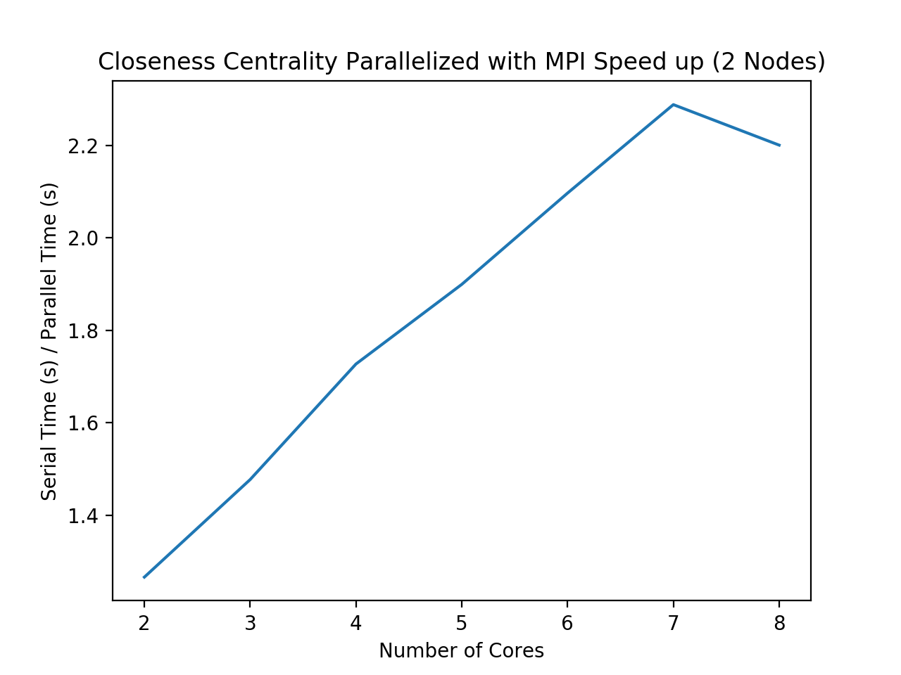

# Breadth First Search

Breadth first search (BFS) is an algorithm that traverses trees or graph data structures. It is useful for finding the shortest path in an unweighted graph data structure. It accomplishes this in an undirected graph (which is what we focus on for this project), by starting at a specified source node, and visits each child node, keeping track of nodes it already visits along the way. This is algorithm can be useful in analyzing large networks. 

## Sequential Algorithm
For a graph, g, and starting node, s, the algorithm is as follows:
1.	Create an array, V, that records with nodes of g have been visited. Mark the entry at node s as visited.
2.	Create a queue, Q, that contains the next nodes to be visited. Assign the first node to be visited as s.
3.	While Q is not empty: Access the first node in Q, erase it from Q, and  check if this node has already been visited, as marked in V. If not visited, add it to the end of Q, and mark as visited in V.

Note: Print out order of traversal by printing out the next element at the front of Q

## Parallelization

As described above, the BFS algorithm must keep track of which nodes were visited as it traverses through the tree, and it must keep a queue of nodes to visit next. It is possible to implement a distributed memory BFS, either by breaking the graph into subgraphs to send to processors, or by sending the vertices to different processors. The main challenge is understanding how to divide independent work to each processor, as BFS relies on its knowledge that it has visited a node and what is next to visit - both of which indicate it is a sequential-based algorithm. As a result, this synchronization of information is difficult to achieve. It is doable, however most sources dedicate a great deal of research and time for this one task. After many attempts and debugging efforts, we decided that for the scope of this project, we will focus on parallelizing BFS solely with open MP.

### Parallelization with OpenMP 
We were able to parallelize BFS with OpenMP, as follows:
```c++
while(!Q.empty()){
	// pop off head of Q
	#pragma omp critical
	{
	s = Q[0];
	cout << s << " ";
	Q.erase(Q.begin());
	}

	// mark and enqueue all unvisited neighbor nodes of s
	#pragma omp parallel for
	for (int i = 0; i < num_vertices; i++){
		// if not visited, mark as true in visited,and push into queue
		// else, do nothing
		if (A[s][i] == 1 && (!visited[i])){
			#pragma omp critical
			{
			visited[i] = true;
			Q.push_back(i);
			}
		}
	}
}
```
Note that we included ```#pragma omp critical``` to indicate that each processor has a common queue or array and it locks it in, keeping a sort of global copy among all jobs. Although not the most efficient way to parallelize (some threads may remain idle), it is a more intuitive and simpler approach to reduce execution time. 


From the plot above, we see that in general, speed up with open mp is high (remains between 11 -13.5). The speed up initially increases sharply when utilizing between 2 to 4 nodes. This makes sense, because the serial time to compute will increase while parallel execution time will not be as high since parallelizing the loops will reduce time to compute. However, there is a slight slowdown in speed up after 4 cores. We may see this because eventually the parallelized code will reach maximum speed up, i.e. more points to each processor slows it down. In addition, the time for each processor to communicate to each other increases, and synchronization overhead may increase.

# Closeness Centrality

Closeness Centrality finds the most central node in a graph. It is very useful for analyzing large networks, such as social networks. 

## Sequential algorithm
For each node in a connected graph g, with starting vertex, s:
1.	Find the minimum distances to all other nodes, or path, from s. Distance is calculated through a minimum spanning tree algorithm - we use prims algorithm. 
2.	Sum all of these distances. 
3. 	If the sum is greater than 0 and the graph has more than 1 node, calculate closeness centrality by dividing the number of nodes by this sum. Otherwise, set the closeness measure for this node to 0. 
The node with the smallest value is the most central.

## Parallelization
### Parallelization with MPI
Closeness centrality algorithm was not designed to be computationally efficient on large graph structures because it requires visiting each node and find the minimum path. From our implementation of Prim?s algorithm, we can see that parallelization of this alone is a non-trivial task. Previous literature suggests that speed up is mainly achieved though parallelizing the minimum path algorithm used to find distance (prim?s algorithm in our case), and then using implementing a hybrid parallelization. Thus, for MPI parallelization of closeness centrality algorithm, we first use our MPI parallelized prims algorithm to first see how much it does speed up closeness centrality alone. See prims algorithm section for how we parallelized this minimum spanning path with MPI. We see below that speed up is nearly linear, which demonstrates how efficient MPI can coordinate communication and synchronization between processors.



### Hybrid Parallelization with MPI and OpenMP
We created the hybrid version with OpenMP that reduces execution time by first incorporating prims hybrid parallelization. Then, we focus on parallelizing the loop that goes through and sums the minimum distance from the source vertex and all other vertices (found from prims algorithm), as follows:

```c++
    // create p: a list containing the path lengths from node s to all other nodes
    vector<int> p(num_vertices);
    int summ = 0;
    int k = 0;
    #pragma omp parallel for private(k) shared(summ)
    for(int k=0; k < num_vertices-1; k++){
        int cr = row_ls[k];
        int cc = col_ls[k];
        if(k == 0){ // if current node is the first node, add weight
            p[k] = A[cr * num_vertices + cc];

        }
        else if(cr == row_ls[0]){ // if current node is same as first node, add weight
            p[k] = A[cr * num_vertices + cc];
        }

        else if(cr == col_ls[k-1]){ 
             int pc = col_ls[k-1];
            summ = summ + A[cr * num_vertices + pc];
            p[k] = summ;
            }
        }
    return p;
```

We include execution times for different parallelization variations with OpenMP and MPI:

| Version | Description | Execution Time |
|------------|----------------|-----------------------|
| Single MPI task launched per node | 4 threads/task, 1 task/node | 36.8606 s |
| Single MPI task launched on each socket | 2 threads/task, 2 tasks/node | 41.9157 s |
| No shared memory (all MPI) | 1 thread/task, 4 tasks/node | 44.5355 s |


We also were able to achieve nearly linear speed up when we varied the number of tasks per node used (2 to 8) on 2 worker nodes.


