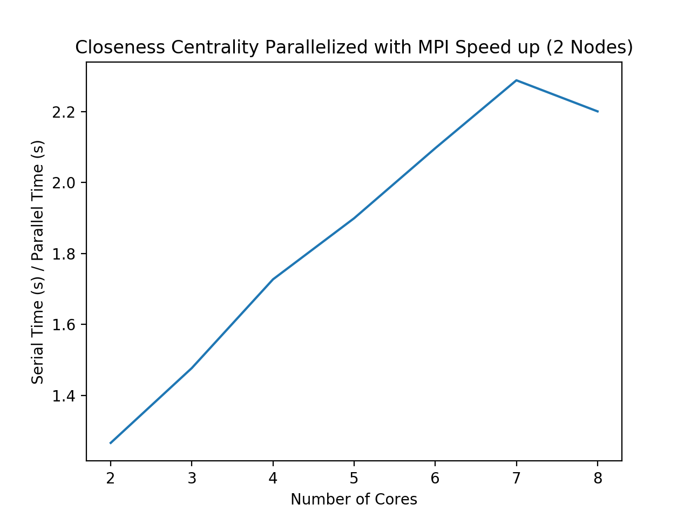
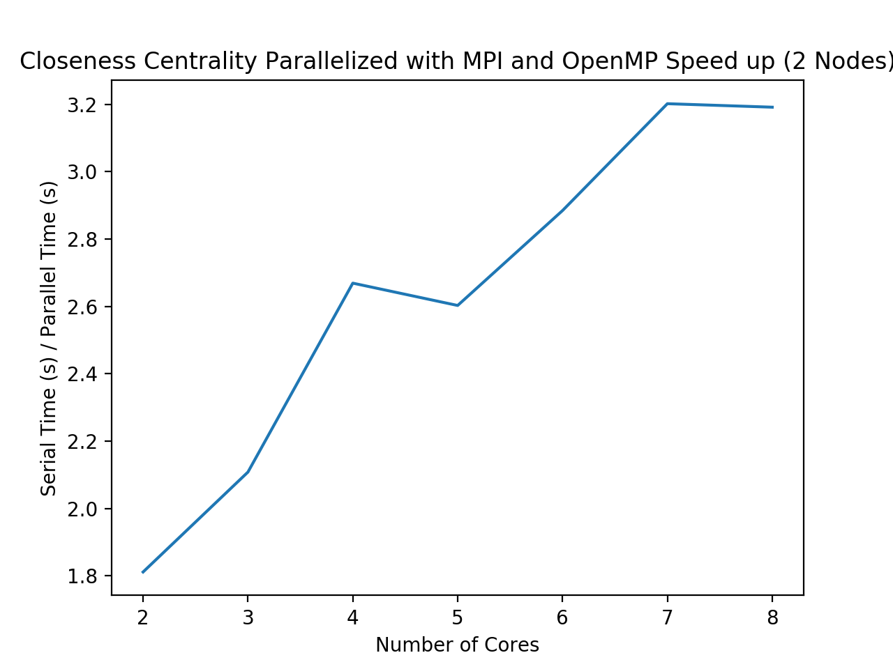

# Closeness Centrality

Closeness Centrality finds the most central node in a graph. It is very useful for analyzing large networks, such as social networks. 

## Sequential algorithm
For each node in a connected graph g, with starting vertex, s:
1.	Find the minimum distances to all other nodes, or path, from s. Distance is calculated through a minimum spanning tree algorithm - we use prims algorithm. 
2.	Sum all of these distances. 
3. 	If the sum is greater than 0 and the graph has more than 1 node, calculate closeness centrality by dividing the number of nodes by this sum. Otherwise, set the closeness measure for this node to 0. 

The node with the smallest value is the most central.<a id="note5" href="#note5ref"><sup>5</sup></a> Because the algorithm must find the minimum path while visiting each node in the graph, the time complexity of this algorithm is O(n*m + n), where n represents total number of nodes, and m represents total number of edges.

## Parallelization
### Parallelization with MPI
Closeness centrality algorithm was not designed to be computationally efficient on large graph structures because it requires visiting each node and find the minimum path. From our implementation of Prim?s algorithm, we can see that parallelization of this alone is a non-trivial task. Previous literature suggests that speed up is mainly achieved though parallelizing the minimum path algorithm used to find distance (prims algorithm in our case), and then using implementing a hybrid parallelization. Thus, for MPI parallelization of closeness centrality algorithm, we first use our MPI parallelized prims algorithm to first see how much it does speed up closeness centrality alone. See prims algorithm section for how we parallelized this minimum spanning path with MPI. We see below that speed up is nearly linear, which demonstrates how efficient MPI can coordinate communication and synchronization between processors. The time complexity of this algorithm is O((n*m+n)/p) + O(n*m log p), where n is the number of nodes, m is the number of edges and p is the number of processors.<a id="note3" href="#note3ref"><sup>3</sup></a><a id="note4" href="#note4ref"><sup>4</sup></a>

### Hybrid Parallelization with MPI and OpenMP
We created the hybrid version with OpenMP that reduces execution time by first incorporating prims hybrid parallelization. Then, we focus on parallelizing the loop that goes through and sums the minimum distance from the source vertex and all other vertices (found from prims algorithm), as follows:

```c++
    // create p: a list containing the path lengths from node s to all other nodes
    vector<int> p(num_vertices);
    int summ = 0;
    int k = 0;
    #pragma omp parallel for private(k) shared(summ)
    for(int k=0; k < num_vertices-1; k++){
        int cr = row_ls[k];
        int cc = col_ls[k];
        if(k == 0){ // if current node is the first node, add weight
            p[k] = A[cr * num_vertices + cc];

        }
        else if(cr == row_ls[0]){ // if current node is same as first node, add weight
            p[k] = A[cr * num_vertices + cc];
        }

        else if(cr == col_ls[k-1]){ 
             int pc = col_ls[k-1];
            summ = summ + A[cr * num_vertices + pc];
            p[k] = summ;
            }
        }
    return p;
```

### Test Data
Because closeness centrality is computationally expensive to run, for the purposes of testing, we ran this code on a subgraph of the graph used to test prims algorithm (mst_test3_sub.txt). The graph contains 500 nodes and is formatted like so

| vertex 1 | vertex 2 | edge weight |
|-----------|------------|-----------|
| 0 | 1 | 1 |
| 1 | 2 | 1 |
| 0 | 3 | 1 |

The serial runtime for this algorithm is 93.39 seconds.

### Results 

#### MPI

We ran this code with 2-8 tasks on two nodes and produced the speed up table and plot below.

| Version | Processors (#) | Speed Up |
|------------|---------------------|----------------|
| MPI | 2 | 1.267 |
| MPI | 3 | 1.478 |
| MPI | 4 | 1.727 |
| MPI | 5 | 1.899 |
| MPI | 6 | 2.069 |
| MPI | 7 | 2.288 |
| MPI | 8 | 2.200 |

Note the speed up increases as the number of processors increases. We see below in the speed up plot that speed up with MPI is nearly linear, with a slight tick downwards from 7 to 8 cores. This shows that MPI is a powerful parallelization tool on an otherwise computationally expensive algorithm.



#### Hybrid
We ran the code with different parallelization variations of hybrid parallelization using OpenMP and MPI, found in the table below:

| Version | Description | Execution Time |
|------------|----------------|-----------------------|
| Single MPI task launched per node | 4 threads/task, 1 task/node | 36.8606 s |
| Single MPI task launched on each socket | 2 threads/task, 2 tasks/node | 41.9157 s |
| No shared memory (all MPI) | 1 thread/task, 4 tasks/node | 44.5355 s |

Note that these execution times are all almost half of the serial execution time of 93 seconds. Running the code with 4 threads/task, 1 task/node seemed to perform the best indicating that the algorithm responds better when utilizing more threads per task and less tasks per node. This makes sense, as load balancing varies between the many components of this algorithm.

We then ran the code with 2-8 tasks/cores on two nodes to understand how increasing threads/task affects speed up.  



We see from the plot above that we were able to achieve nearly linear speed up, as show below. This shows that increasing the number of cores does improve speed up.

<a id="note3" href="#note3ref"><sup>3</sup></a>[A Faster Method to Estimate Closeness Centrality Ranking](https://arxiv.org/pdf/1706.02083.pdf)  <a id="note4" href="#note4ref"><sup>4</sup></a>[An efficient Parallel Algorithm for Computing the Closeness Centrality in Social Networks](https://dl.acm.org/doi/pdf/10.1145/3287921.3287981?download=true) <a id="note5" href="#note5ref"><sup>5</sup></a>[Closeness Centrality (Centrality Measure)](https://www.geeksforgeeks.org/closeness-centrality-centrality-measure/)
