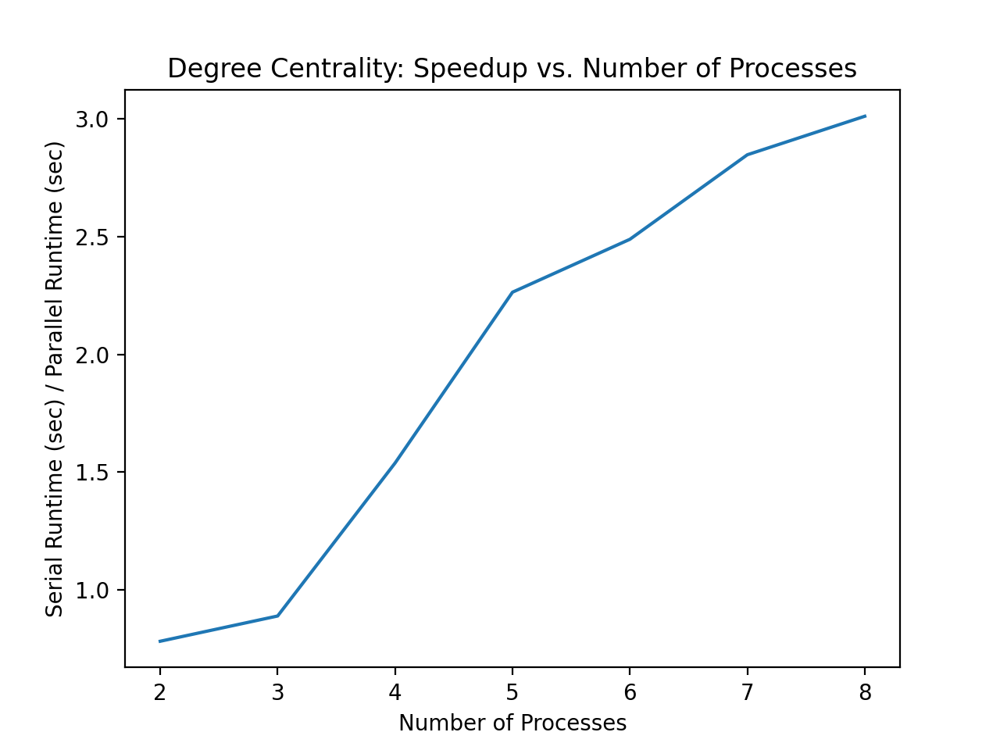

# Degree Centrality

For each node, degree centrality finds the proportion of the graph that the node is directly connected to. It is useful to determine important nodes in a graph, such as identifying key influencers in a social graph. 

## Sequential algorithm
For each node 's' in a graph: 
1. Find number of nodes that 's' shares an edge with
2. Compute degree centrality: ratio between number of neighbors and total nodes in graph 

Degree centrality for a node 's' represents the proportion of the graph that 's' is directly connected to. If a node has a degree centrality score of 0, it is disjoint from the rest of the graph. If a node has a degree centrality score of 1, it is directly connected to every other node in the graph. Using an adjacency matrix, the time complexity of this algorithm is O(n*n), where n is the number of nodes in the graph, as for every node it determines if there exists an edge to every other node. 

## Parallelization
### Parallelization with MPI

To parallelize the degree centrality algorithm using MPI, we first made use of the parallel implementation of the adjacency matrix distribution. The adjacency matrix was divided into p components, where p is the number of processes, and these subsets of the adjacency matrix were distributed to their corresponding processes. We then computed degree centrality on the subset of nodes for each process. For a particular node, this calculated the ratio between the number of neighboring nodes and the total nodes in the graph. Speed up was mainly achieved by dividing up the adjacency matrix and running degree centrality on a subset of nodes in each process. Refer to the adjacency matrix section for details about how the adjacency matrix distribution was parallelized using MPI. 

The speed up achieved for degree centrality generally demonstrated a linear relationship with the number of processes. We generally saw performance improvements with the parallelized version, although communication overhead proved to be a bottleneck in some cases. The time complexity of this algorithm is O(n*n/p), where n is the number of nodes and p is the number of processes. 

```c++
void deg_centrality(int rank) {
    MPI_Barrier(MPI_COMM_WORLD);
    for (int i = row_offset; i < (nper+row_offset); i++) {
        DegCent degCent;
        degCent.v = i;
        int sum = 0;
        for (int j = 0; j < num_vertices; j++) {
            if(A[i * num_vertices + j] == 1)
                sum++;
        }
        degCent.deg = (double) sum / (num_vertices - 1);
        MPI_Bcast(&degCent, 1, MPI_DOUBLE_INT, rank, MPI_COMM_WORLD);
        if (rank==0){
            cout << degCent.v << "\t" << degCent.deg << endl;
        }
    }
}
```

### Test Data
We ran the degree centrality algorithm on the all.edges file, which contains a list of edges from the Facebook data in the Stanford dataset. The data contains 170,174 edges and is formatted as follows: 

| node 1 | node 2 |
|-----------|------------|
| 98 | 331 |
| 299 | 194 |
| 122 | 141 |
| 84 | 236 |
| 133 | 62 |

The serial runtime for this degree centrality on the all.edges file is 0.051459 seconds. 

### Results 

#### MPI

This code was executed on an MPI cluster, with 2-8 tasks on 2 nodes. The speed up table and plot are below:

| Version | Processors (#) | Speed Up |
|------------|---------------------|----------------|
| MPI | 2 | 0.78269877 |
| MPI | 3 | 0.88990459 |
| MPI | 4 | 1.53919091 |
| MPI | 5 | 2.26431284 |
| MPI | 6 | 2.48892393 |
| MPI | 7 | 2.84767992 |
| MPI | 8 | 3.01109434 |

As shown in the table above, the speed up generally increases as the number of processors increases. Notice that the speed up is below 1.0 for 2 and 3 processes, which is likely due to the communication and synchronization overhead. MPI was fairly successful at parallelizing the algorithm based on these speed ups. In the plot below, we can see that the speed up generally increases linearly with the number of processes. 



The plot above shows that we have achieved a speed up that is approximately linear for the parallelized degree centrality algorithm. As we increase the number of processes, we generally see performance improvements.
