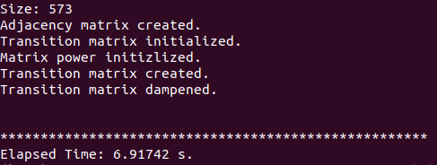
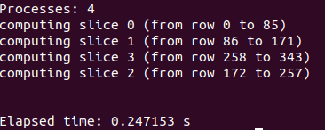
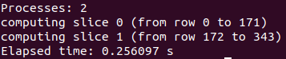

# Instructions for Running Code

To download the code and tests to your local machine, please use one of the following options: 

**Clone the GitHub Repository**

```
git clone https://github.com/kaelanelson/CS205-Final-Project.git
```

**Download and Extract ZIP File**

[Link](https://github.com/kaelanelson/CS205-Final-Project/archive/master.zip)

## Prim's Algorithm

Data file must be adjacency list in the format  `v1 v2 w`

### Sequential 

```bash
g++ Sequential/prims.cpp -o prims
./prims data/generatedMstDataPrims.txt
```

### MPI

Must be run on cluster configured like so: https://harvard-iacs.github.io/2020-CS205/lab/I7/guide/Guide_I7.pdf

Run on all nodes

```bash
mpic++ prims_mpi.cpp -o prims_mpi
cp prims_mpi cloud/
```

Then from the master node run

```bash
mpirun -np 4 -hosts master,node1 ./prims_mpi generatedMstDataPrims.txt
```

### Hybrid

Must be run on cluster configured like so: https://harvard-iacs.github.io/2020-CS205/lab/I7/guide/Guide_I7.pdf

Run on all nodes, where x is the number of threads

```bash
export OMP_NUM_THREADS=x
mpic++ -fopenmp prims_hybrid.cpp -o prims_hybrid
cp prims_hybrid cloud/
```

Then from the master node run

```bash
mpirun -np 4 -hosts master,node1 ./prims_hybrid generatedMstDataPrims.txt
```

## Kruskal's Algorithm

Data file must be adjacency list in the format  `v1 v2 w`

### Sequential 

```bash
g++ Sequential/kruskals.cpp -o kruskals
./kruskals data/generatedMstDataPrims.txt
```

### MPI

Must be run on cluster configured like so: https://harvard-iacs.github.io/2020-CS205/lab/I7/guide/Guide_I7.pdf

Run on all nodes

```bash
mpic++ kruskals_mpi.cpp -o kruskals_mpi
cp kruskals_mpi cloud/
```

Then from the master node run

```bash
mpirun -np 4 -hosts master,node1 ./kruskals_mpi generatedMstDataKruskals.txt
```

### Hybrid

Must be run on cluster configured like so: https://harvard-iacs.github.io/2020-CS205/lab/I7/guide/Guide_I7.pdf

Run on all nodes, where x is the number of threads

```bash
export OMP_NUM_THREADS=x
mpic++ -fopenmp kruskals_hybrid.cpp -o kruskals_hybrid
cp kruskals_hybrid cloud/
```

Then from the master node run

```bash
mpirun -np 4 -hosts master,node1 ./kruskals_hybrid generatedMstDataKruskals.txt
```

## BFS Algorithm

Data file must be adjacency list in the format  `v1 v2`

### Sequential
```bash
g++ -DUSE_CLOCK bfs.cpp timing.cpp -o bfs
time ./bfs all.edges
```

### OpenMP

Must be run on cluster configured like so: https://harvard-iacs.github.io/2020-CS205/lab/I6/guide/Guide_I6.pdf


```bash
export OMP_NUM_THREADS=x
g++ -fopenmp -Ofast bfs_omp.cpp -o bfs_omp
./bfs_omp all.edges
```

## Closeness Centrality

Data file must be adjacency list in the format  `v1 v2 w`

### Sequential

```bash
g++ -DUSE_CLOCK closeness_centrality.cpp timing.cpp -o cc
time ./cc mst_test3_sub.txt
```

### MPI

Must be run on cluster configured like so: https://harvard-iacs.github.io/2020-CS205/lab/I7/guide/Guide_I7.pdf

Run on all nodes

```bash
mpic++ cc_mpi.cpp -o ccm
cp ccm cloud/
```

Then, on master node, run (with x processors):

```bash
mpirun -np x -hosts master,node1 ./ccm mst_test3_sub.txt 
```

### Hybrid

Must be run on cluster configured like so: https://harvard-iacs.github.io/2020-CS205/lab/I7/guide/Guide_I7.pdf

Run on all nodes, where x is the number of threads

```bash
export OMP_NUM_THREADS=x
mpic++ -fopenmp cc_hybrid.cpp -o cch
cp cch cloud/
```

Then, on master, run:
```
mpirun -np x -hosts master,node1 ./cch mst_test3_sub.txt 
```

## PageRank

The first sections demonstrate how to run the code for your own data. The later section demonstrates how to run the tests used for the performance evaluation. 

Data file must be a text file with one edge per line in the format  `v1 v2` where `v1` is the first node (vertex) and `v2` is the second node.

### Sequential

**Location: /Sequential/pagerank.cpp**

To run, you must first compile the program with the following command line code.

```
g++ -DUSE_CLOCK pagerank.cpp timing.cpp -o pagerank
```

You might need to specify the C++11 library as so: 

```
g++ -std=c++11 -DUSE_CLOCK pagerank.cpp timing.cpp -o pagerank
```

Run the code and provide a text file input as follows:

```
./pagerank [input file]
```

The terminal will show the following information when running correctly.



The PageRank output, sorted by node number, will be written to `pagerankOutput.txt` unless configured below. 

#### Configuration

##### Output File Location and Name

To change the output file location and name, edit Line 19:

```
string outfileName = "yourFileName.txt"; 
```

##### Number of Convergence Steps

To change the number of convergence steps, (more steps result in more accurate ranks), edit Line 18:

```
int totalSteps = 5;
```

The default is 5 steps.

### MPI

The following code can be run on an instance with the MPI library installed or an MPI cluster as set up in the [CS205 Lab I7 Guide: MPI on AWS]( https://harvard-iacs.github.io/2020-CS205/lab/I7/guide/Guide_I7.pdf). Please note that the current implementation of this code only works with files whose total number of nodes (vertices) is divisible by the number of processes specified. 

To compile, run the relevant user on the master node, run:

```
mpic++ pagerank_mpi.cpp -o pagerank_mpi
cp pagerank_mpi cloud/
```

Once in the `cloud` directory, you can run the program on a single node:

```
mpirun -np [number of proceses] ./pagerank_mpi [input file]
```

Or to run on multiple nodes (two shown as an example), execute the following code on the master node:

```
mpirun -np [number of proceses] -hosts master,node1 ./pagerank_mpi [input file]
```

The terminal will show the row partitions for each of the processes when working correctly.



#### Configuration

The MPI implementation of PageRank requires a bit more configuration than that of the sequential version.

##### Set Number of Nodes (Vertices) 

The number of nodes must be set manually in the code in Line 14 before compiling. 

```
#define numVertices 8
```

##### Output File Location and Name

The output file location and name can be changed as in the sequential version as shown above.

##### Number of Convergence Steps

The number of convergence steps can be changed as in the sequential version as shown above.

### MPI + OpenMP

As with the MPI version, the following code can be run on an instance with the MPI library installed or an MPI cluster as set up in the [CS205 Lab I7 Guide: MPI on AWS]( https://harvard-iacs.github.io/2020-CS205/lab/I7/guide/Guide_I7.pdf). Please note that the current implementation of this code only works with files whose total number of nodes (vertices) is divisible by the number of processes specified. 

```
mpic++ pagerank_hybrid.cpp -fopoenmp -o pagerank_hybrid
cp pagerank_hybrid cloud/
```

Once in the `cloud` directory, you can run the program on a single node:

```
mpirun -np [number of proceses] ./pagerank_hybrid [input file]
```

Or to run on multiple nodes (two shown as an example), execute the following code on the master node:

```
mpirun -np [number of proceses] -hosts master,node1 ./pagerank_hybrid [input file]
```

The terminal will show the row partitions for each of the processes when working correctly.



#### Configuration

The MPI implementation of PageRank requires the same kind of configuration as that of the MPI version.

##### Set Number of Nodes (Vertices) 

The number of nodes must be set manually in the code as shown in the MPI version configuration. . 

##### Output File Location and Name

The output file location and name can be changed as in the sequential or MPI version as shown above.

##### Number of Convergence Steps

The number of convergence steps can be changed as in the sequential or MPI version as shown above.

### Tests

To reproduce our exact performance results, see [Specs](Specs.html) for our infrastructure specifications. Otherwise, you may run on your own cluster environment with relevant dependencies to compare. 

#### Sequential

You can run the sequential tests for all three files by following the compile directions for the sequential version above. Then run the following code. (Assuming the files are in the same directory as the executable file.) Please note that the 4032.edges file requires more than an hour to run sequentially on an AWS m4.2xlarge instance. 

```
./pagerank 344.edges 
./pagerank 0_414.edges 
./pagerank 4032.edges
```

#### MPI

In the `Tests/` folder, we have provided three MPI PageRank programs already configured to the the correct number of nodes and to separate output files. Be sure to move the relevant files from the `/data/facebook` directory.  Follow the same instructions as shown above for MPI. The compile and run commands are shown below:

```
mpic++ pagerank_mpi_344.cpp -o pagerank_mpi_344
mpirun -np [number of proceses] -hosts master,node1 ./pagerank_mpi_344 344.edges
```

```
mpic++ pagerank_mpi_1912.cpp -o pagerank_mpi_1912
mpirun -np [number of proceses] -hosts master,node1 ./pagerank_mpi_1912 1912.edges
```

```
mpic++ pagerank_mpi_4032.cpp -o pagerank_mpi_4032
mpirun -np [number of proceses] -hosts master,node1 ./pagerank_mpi_4032 4032.edges
```

#### MPI + OpenMP

In the `Tests/` folder, we have also provided three MPI PageRank programs already configured to the the correct number of nodes and to separate output files. Follow the same instructions as shown above for MPI + OpenMP. Be sure to move the relevant files from the `/data/facebook` directory. The compile and run commands are shown below:

```
mpic++ pagerank_hybrid_344.cpp -o pagerank_hybrid_344
mpirun -np [number of proceses] -hosts master,node1 ./pagerank_hybrid_344 344.edges
```

```
mpic++ pagerank_hybrid_1912.cpp -o pagerank_hybrid_1912
mpirun -np [number of proceses] -hosts master,node1 ./pagerank_hybrid_1912 0_414.edges
```

```
mpic++ pagerank_hybrid_4032.cpp -o pagerank_hybrid_4032
mpirun -np [number of proceses] -hosts master,node1 ./pagerank_hybrid_4032 4032.edges
```

