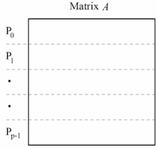

# Minimum Spanning Tree Algorithms
A minimum spanning tree is the tree of minimum weight that touches every edge in a graph. Finding a MST is incredibly important when analyzing graphs, and is often a precursor for other analyses, such as centrality. Two of the most common MST algorithms are Prim's algorithm and Kruskal's algorithm.
## Prim's Algorithm
### Sequential Algorithm
Prim's for a connected graph, g, and starting vertex, s, is as follows:

1. Mark vertex s as visited
2. Iterate over all edges touching s, finding the smallest weight edge
3. Add this edge to our MST and mark the other vertex, v2, as visited
4. Continue iterating over all edges touching an edge we have visited connecting to a vertex we have not visited, selecting the smallest weight edge.
5. Again, add this edge to our MST and add mark the new vertex as visited.
6. Continue until add vertices have been visited

This algorithm, while using an adjacency matrix, for each vertex, must iterate over all vertices that vertex may touch. As such, the complexity, where V = number of vertices, is O(V^2)

### Parallelizing w/ MPI
Parallelizing Prim's algorithm is non-trivial, as for every vertex added to the MST, you must compare all new edges, which potentially spans all vertices in the graph. I will thus Parallelizing it in the manner described by Vladimir Loncˇar, Srdjan Škrbic´ and Antun Balaz in "Parallelization of Minimum Spanning Tree Algorithms Using Distributed Memory Architectures"<a href="#note1" id="note1ref"><sup>1</sup></a>

1. Partition the Adjacency matrix such that each process gets an equal chunk, like so 
2. Like in the sequential version, start at a given vertex, s.
3. Each process checks it's group of vertices for the minimum edge including our starting vertex to an unvisited vertex and communicates that edge back to the root
4. The root determines the minimum of the minimums, and communicates the new visited vertex to all processes.
5. Continue until all vertices have been visited.

The time complexity of this updated algorithm, there V is the number of vertices and p is the number of processes is O((V^2/p) + O(v log p)

### Discussion of MPI Code
Implementing this algorithm with MPI required the following:

1. To divide up the array, I changed my adjacency matrix A, from a 2d array to a 1d array, to preserve consecutive memory of vertices.

2. Each process gets it's block of rows like so 

   ```c++
   void distributeAdjacencyMatrix(int rank){
       MPI_Status status;
       if (rank == 0) {
           for (int i = 1; i < size; i++) {
               MPI_Send(&A[blocksize*i], blocksize, MPI_INT, i, 1, MPI_COMM_WORLD);
           }
       } else {
           MPI_Recv(&A[offset], blocksize, MPI_INT, 0, 1, MPI_COMM_WORLD, &status);
       }
   }
   ```

    where offset is the index where each process's portion of the array starts, and block-size is the number of array elements per process.

3. In order to determine the minimum of minimum, and update each process's visited array accordingly, I do the following, adapted from "Prim Minimum Spanning Tree using MPI"<a href="#note2" id="note2ref"><sup>2</sup></a>

  ```c++
  typedef struct { int v1; int v2; } Edge;
  
  Edge edge;
  struct { int min; int rank; } minRow, row;
  
  ```

  ```c++
  row.min = min;
  row.rank = rank; // the rank of min in row
  // This reduction via // This way of reducing to find the min via https://github.com/elahehrashedi/MPI_Prime_MST/blob/master/PrimMPI.c
  MPI_Allreduce(&row, &minRow, 1, MPI_2INT, MPI_MINLOC,MPI_COMM_WORLD);
  edge.v1 = r;
  edge.v2 = c;
  MPI_Bcast(&edge, 1, MPI_2INT, minRow.rank, MPI_COMM_WORLD);
  MPI_Bcast(&min, 1, MPI_INT, minRow.rank, MPI_COMM_WORLD);
  ```

  For my exact implementation, please reference `prims_mpi.cpp`


### Hybrid Prim's Implementation
I will modify my parallel MPI version of Prim's algorithm to also use OpenMP, thus creating a hybrid parallel program. In doing so, I will update the loops to find relative minimum edges to do so in parallel like so 

```c++
int i = 0;
        #pragma omp parallel for private(i) shared(nper, row_offset, selected, A, min)
        for (i = row_offset; i < (nper+row_offset); i++) {
            if (selected[i] == 1) {
                for (int j = 0; j < num_vertices; j++) {
                    if (selected[j] == 0  && A[i * num_vertices + j] != 0) { // not in selected and there is an edge
                        if (min > A[i * num_vertices + j]) {
                            min = A[i * num_vertices + j];
                            r = i;
                            c = j;
                        }

                    }
                }
            }
        }
```

 

### Discussion
All timing was done on m4.xlarge instances using either MPI_Time or ctime. Please see specs section for reproducibility section.


| Version | Time   | Servers   | MPI Processes per Server  | OpenMP Threads  | Speedup|
|---|---|---|---|---|---|
| Sequential  |  2.79613 s |  N/A | N/A  | N/A|N/A|
| MPI| 2.30927 s | 1| 1| N/A|1.21|
| MPI | 1.19981 s| 1| 2| N/A|2.33|
| MPI | 1.28366 s| 2| 1| N/A|2.18|
| MPI | 0.745341 s| 2| 2| N/A|3.75|
| MPI | 0.702907 s| 2| 4| N/A|3.98|
| Hybrid | 0.992064 s|2 | 1 | 1|2.82|
| Hybrid | 0.686465 s|2 | 1 | 2|4.07|
| Hybrid | 0.614535 s|2 | 2 | 2|4.54|


<a id="note1" href="#note1ref"><sup>1</sup></a>[Parallelization of Minimum Spanning Tree Algorithms Using Distributed Memory Architectures](http://www.scl.rs/papers/Loncar-TET-Springer.pdf)
<a id="note2" href="#note2ref"><sup>2</sup></a>[Prim Minimum Spanning Tree using MPI
](https://github.com/elahehrashedi/MPI_Prime_MST/blob/master/PrimMPI.c)

## Kruskal's Algorithm
Kruskal's algorithm works by creating a forest out of all vertices in a graph and then merging forests of connected vertices with the lowest weight connection. 

Kruskal's algorithm offers a few key advantages to Prim's. Most significantly, at least w.r.t. my implementations, Kruskal's algorithm operates best on an Adjacency List, while Prim's works on an Adjacency Matrix. This is a huge advantage for large graphs, as, given V vertices and E edges, Kruskal's only takes E space, while Prim's takes V^2 space. This benefit is especially notable if the adjacency matrix is sparse, as sending it to and from processes is very taxing and adds overhead, compared to the minimal overhead of sharing edges.


My implementation uses disjoint sets as the representations of the forests. The code for implementing a disjoint set in C++ is from GeeksForGeeks.<a href="#note3" id="note3ref"><sup>3</sup></a>

My implementation sorts edges based on weight. I use C++'s quicksort implementation to do so, which takes, on average O(n log n)
### Sequential Algorithm

1. Create a new Disjoint Set for each vertex in the graph. These Disjoint Sets represent random forests, each of which now has only 1 member.
2. Sort all edges in the graph by weight, ascending.
3. Select the lowest weight edge, and combine forests of the two vertices this edge touches. Make one of these vertices forest the parent of the other's.
4. Continue selecting the next lowest weight edge, checking if the two vertices that edge connects are part of same forest. If they are not, combine them like before.
5. Continue until all vertices are part of the same singular forest.
6. This forest represents a MST

### Parallelizing w/ MPI

As with Prim's, I parallelized this algorithm as described by Vladimir Loncˇar, Srdjan Škrbic´ and Antun Balaz in "Parallelization of Minimum Spanning Tree Algorithms Using Distributed Memory Architectures"<a href="#note4" id="note4ref"><sup>4</sup></a>.

This algorithm is as follows:

1. Assign each process an equal range of vertices. Send each process any edge that contains a vertex in its range.
2. Each process uses Kruskal's algorithm to find the MST of its edges. Half of all processes send the edges in its tree, while half of all processes recieve the edges in another processes' tree. The sending processes can terminate.
3. Sort these edges again and perform Kruskal's algorithm.
4. Continue doing this until only 1 process remains, which now has the MST.

As stated before, the communications overhead ere is much less than with Prim's. However, one downside to this parallel Kruskal's implementation half of all processes are done working after each iteration, which means that these processes are no longer contributing to the computation.

The time complexity of this implementation, with p processes and V vertices, is 
O(V^2/p) + O(V^2 log p)	

### Discussion of MPI Code

Implementing an MPI version of Kruskal's algorithm required the following

1. I created a new MPI datatype for an edge as follows. This made it easier to send lists of edges to and from processes. 

   ```c++
   // Declaring an MPI datatype for an edge, which is just 3 ints
   MPI_Type_contiguous(3, MPI_INT, &mpi_edge);
   MPI_Type_commit(&mpi_edge);
   ```

    This datatype stores two vertices and a weight.

2. I read in edges like so, creating a new lists of edges for each process in the root process and then sending each process their list. 

   ```c++
   string i1, i2, i3;
       while (!file.eof()) {
           file >> i1;
           file >> i2;
           file >> i3;
           edge e = { stoi(i1), stoi(i2), stoi(i3)};
           int process_v1 = e.v1/range_per_process;
           int process_v2 = e.v2/range_per_process;
           // Assign this edge to the process responsible for v1
           edgesPerProcess[process_v1][numEdgesPerProcess[process_v1]] = e; 
           numEdgesPerProcess[process_v1]++;
           // Assign this edge to the process responsible for v2 (if different)
           if(process_v1 != process_v2){
               edge e2 = { stoi(i1), stoi(i2), stoi(i3)};
               edgesPerProcess[process_v2][numEdgesPerProcess[process_v2]] = e2; 
               numEdgesPerProcess[process_v2]++;
           }
   
       }
       file.close();
       for (int i =1;i < size; i++){
           // Send each process the number of edges 
           MPI_Send(&num_vertices, 1, MPI_INT, i, 0, MPI_COMM_WORLD);
           MPI_Send(&numEdgesPerProcess[i], 1, MPI_INT, i, 0, MPI_COMM_WORLD);
           MPI_Send(edgesPerProcess[i], numEdgesPerProcess[i], mpi_edge, i, 1, MPI_COMM_WORLD);
       }
       // For process 0, set my E array to first group of edges
       free(E);
       E = edgesPerProcess[0];
       num_edges = numEdgesPerProcess[0];
   ```

    

3. After applying Kruskal's to its list, processes send and receive the results like so.

   ```c++
   // High ranking processes
   if (rank >= (remaining_processes/2)){
       int to_who = rank - remaining_processes/2;
       MPI_Send(&msf_edge_count, 1, MPI_INT, to_who, 2, MPI_COMM_WORLD);
       MPI_Send(msf_edges, msf_edge_count, mpi_edge, to_who, 3, MPI_COMM_WORLD);
   } else {
       int from_who = rank + remaining_processes/2;
       int new_edges;
       MPI_Recv(&new_edges, 1, MPI_INT, from_who, 2, MPI_COMM_WORLD, &status);
       edge* new_E = new edge[new_edges+msf_edge_count];
       MPI_Recv(new_E, new_edges, mpi_edge, from_who, 3, MPI_COMM_WORLD, &status);
   
       for (int i =0;i<msf_edge_count;i++){
           new_E[new_edges+i] = msf_edges[i];
       }
       E = new_E;
       num_edges = new_edges+msf_edge_count;
   }
   ```

   

### Hybrid Kruskal's Implementation
Given that the bulk of Kruskal's algorithm operates on a sorted list, and processing this sorted list in order is necessary, there is not a lot I can parallelize with OpenMP. However, I can add the following two pragmas.

1. The array copy of two Edge lists into a singular edge list shared(msf_edge_count,msf_edges,new_E,new_edges)
   for (i =0;i<msf_edge_count;i++){
       new_E[new_edges+i] = msf_edges[i];
   }
   ```

   

2. The quicksort of the Edge list 

   ```c++
   #pragma omp parallel sections
   { 
         #pragma omp section
       {
           qsort(E, num_edges, sizeof(edge), compare_edges);
       }
   }
   ```

   

### Discussion
All timing was done on m4.xlarge instances using either MPI_Time or ctime. 


Please see specs section for reproducibility information.

I've also calculated speedup, where speedup is the ratio of serial time to parallel time.

| Version | Time| Servers|MPI Processes per Server|OpenMP Threads |Speedup|
|---|---|---|---|---|---|
| Sequential  |  0.683828 s |  N/A | N/A  | N/A|
| MPI| 0.299881 s | 1| 1| N/A|2.28|
| MPI | 0.256351 s| 1| 2| N/A| 2.67|
| MPI | 0.259624 s| 2| 1| N/A|2.63|
| MPI | 0.250793 s| 2| 2| N/A|2.73|
| MPI | 0.356095 s| 2| 4| N/A|1.92|
| Hybrid | 0.258826 s|2 | 1 | 1|2.64|
| Hybrid | 0.258271 s|2 | 1 | 2|2.65|
| Hybrid | 0.258216 s|2 | 2 | 2|2.65|

<a id="note3" href="#note3ref"><sup>3</sup></a>[Kruskal’s Minimum Spanning Tree using STL in C++](https://www.geeksforgeeks.org/kruskals-minimum-spanning-tree-using-stl-in-c/)

<a id="note4" href="#note4ref"><sup>4</sup></a>[Parallelization of Minimum Spanning Tree Algorithms Using Distributed Memory Architectures](http://www.scl.rs/papers/Loncar-TET-Springer.pdf)