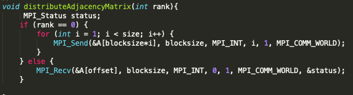
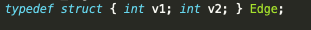
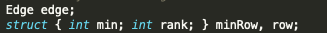
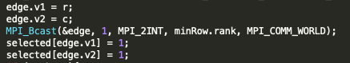
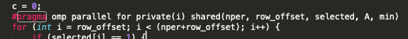

# Minimum Spanning Tree Algorithms
A minimum spanning tree is the tree of minimum weight that touches every edge in a graph. Finding a MST is incredibly important when analyzing graphs, and is often a precursor for other analyses, such as centrality. Two of the most common MST algorithms are Prim's algorithm and Kruskal's algorithm.
## Prim's Algorithm
### Sequential Algorithm
Prim's for a connected graph, g, and starting vertex, s, is as follows:

1. Mark vertex s as visited
2. Iterate over all edges touching s, finding the smallest weight edge
3. Add this edge to our MST and mark the other vertex, v2, as visited
4. Continue iterating over all edges touching an edge we have visited connecting to a vertex we have not visited, selecting the smallest weight edge.
5. Again, add this edge to our MST and add mark the new vertex as visited.
6. Continue until add vertices have been visited

This algorithm, while using an adjacency matrix, for each vertex, must iterate over all vertices that vertex may touch. As such, the complexity, where V = number of vertices, is O(V^2)

### Paralellizing w/ MPI
Paralellizing Prim's algorithm is non-trivial, as for every vertex added to the MST, you must compare all new edges, which potentially spans all vertices in the graph. I will thus Paralellizing it in the manner described by Vladimir Loncˇar, Srdjan Škrbic´ and Antun Balaz in "Parallelization of Minimum Spanning Tree Algorithms Using Distributed Memory Architectures"<a href="#note1" id="note1ref">1</a>

1. Partion the Adjacency matrix such that each process gets an equal chunk, like so 
2. Like in the sequential version, start at a given vertex, s.
3. Each process checks it's group of vertices for the minimum edge including our starting vertex to an unvisited vertex and communicates that edge back to the root
4. The root determines the minimum of the minimums, and communicates the new visited vertex to all processes.
5. Continue until all verticese have been visited.

The time complexity of this updated algorithm, there V is the number of vertices and p is the number of processes is O((V^2/p) + O(v log p)

### Discussion of MPI Code
Implementing this algorithm with MPI required the following:

1. To divide up the array, I changed my adjacency matrix A, from a 2d array to a 1d array, to preserve consequtive memory of vertices.
2. Each process gets it's block of rows like so  where offset is the index where each process's portion of the array starts, and blocksize is the number of array elements per process.
3. In order to determine the minimum of mimimum, and update each process's visited array accordingly, I do the following, adapted from "Prim Minimum Spanning Tree using MPI"<a href="#note2" id="note2ref">2</a>
 
 
 
4. For my exact implementation, please reference `prims_mpi.cpp`

### Hybrid Prim's Implementation
I will modify my parallel MPI version of Prim's algorithm to also use OpenMP, thus creating a hynrid parallel program. In doing so, I will update the loops to find relative minimum edges to do so in paralell like so  

### Discussion

<a id="note1" href="#note1ref">1</a>[Parallelization of Minimum Spanning
Tree Algorithms Using Distributed
Memory Architectures](http://www.scl.rs/papers/Loncar-TET-Springer.pdf)
<a id="note2" href="#note2ref">2</a>[Prim Minimum Spanning Tree using MPI
](https://github.com/elahehrashedi/MPI_Prime_MST/blob/master/PrimMPI.c)

