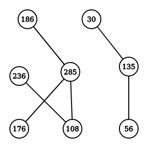

## Model and Data

### Model

The purpose of this project is to improve the runtime of commonly used graph algorithms using parallelization. Thus, we are not using a single model but rather seven different algorithms that can be used to calculate important statistics of graphs. Some algorithms build upon each other but all provide output that is useful even in isolation. For more information on an algorithm, please see its individual page. 

- **Graph Representation as an Adjacency Matrix**: Most graph data is provided in a format where each record is an edge between two nodes. In order to use this information, the data must be transformed into a graph representation such as an adjacency matrix. 
- **Shortest Path Calculation using Breath First Search**: We are often interested in finding the shortest path between two nodes in a graph. An example use case is finding the shortest path between two intersections on a road map. 
- **Minimum Spanning Tree:** We calculate the tree of minimum weight that touches every edge in a graph. For example, if we want to install cablelines that cover a particular neighbor, we want to ensure that we use reach every house in the most efficient way possible. Finding a minimum spanning tree is also often a precursor for other analyses such as centrality. As this is a graph calculation for which many different implementations exist, we will parallelize and compare two different algorithms. 
  - **Prims**
  - **Kruskals**
- **Degree Centrality:** A simple measure of the most important (or central) nodes in a graph is that of the number of edges, or degrees, for each node. 
- **Closeness Centrality**: Another common measure of centrality defines a central node as one that is closer to all other nodes. 
- **PageRank**: Initially developed for ranking web pages, this algorithm can be applied to any graph. It measures centrality through a recursive definition: important nodes are those that are connected to from other important nodes. 

### Data

We are concerned with creating algorithms that are domain agnostic and can be used on a variety of data. Thus, we are not concerned with the specifics of any one dataset. We used a mix of real and artificial datasets to test our algorithms as some algorithms, like Minimum Spanning Tree algorithms, benefitted from particular graph densities for testing. 

Our main test data, the ego-Facebook dataset, was obtained from the **[Stanford Large Network Dataset Collection (SNAP)](https://snap.stanford.edu/data/index.html)** which provides large datasets from diverse domains. These datasets have also been cleaned and prepared for graph analytics, letting us focus on on implementation. There was only minimal data processing required to concatenate edge files as they were provided as separate text files. 

| Dataset                                                      | Type                   | Nodes | Edges  | Description                        | Tested On |
| ------------------------------------------------------------ | ---------------------- | ----- | ------ | ---------------------------------- | --------- |
| [ego-Facebook (Edges files only)](https://snap.stanford.edu/data/ego-Facebook.html) | Undirected, Unweighted | 4039  | 88,234 | Anonymized Facebook social circles |           |
|                                                              |                        |       |        |                                    |           |
|                                                              |                        |       |        |                                    |           |

#### Example Edges File

```
285 186
285 176
236 108
135 56
135 30
```

Each row holds a single edge between two nodes. In the example above, there are 5 edges and 8 nodes. for the ego-Facebook dataset, the nodes (circles) would represent the id of a Facebook user. For example, User 285 is friends with three other users: 186, 176, and 108. The resulting graph could be represented visually as:


