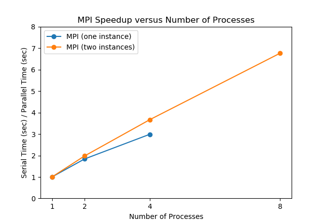
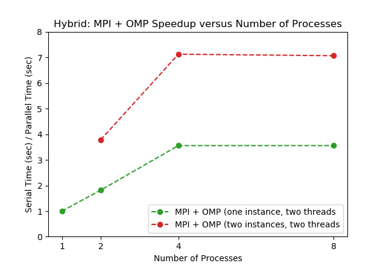

# PageRank

Initially developed  at Google for ranking web pages and named after one of its founders, Larry Page,, this algorithm can be applied to any graph. It measures centrality through a recursive definition: important nodes are those that are connected to and from other important nodes. 

The algorithm leverages Markov Chains to calculate the probability of transitioning from one node to another. This transition probability can be thought of as the "importance" or "centrality" of a node.

This implementation focused on undirected graphs and was adapted from lecture notes from Northeastern University written by Keshi Dai<sup>1</sup>.

## Sequential Algorithm

1. Initialize an adjacency matrix A. 
2. Initialize matrix *B*, a diagonal matrix of ones the same size as *A*.
3. Define the transition matrix of the graph, *T*, by dividing each cell in *A* by its row total. If the row total is 0, divide each cell by the total number of nodes. (This takes care of dangling nodes that can result in the algorithm getting "stuck" on nodes that have no edges.)
4. Apply a dampening factor *d* (typically *d* = 0.85) by multiplying transition matrix *T* by the scalar *d*.
5. Define number of  total number of steps *ts* and initialize *s* to 0. While *s* is less than *st*, perform the following loop:
   1. Multiply *B* by *T*. Do this using nested for loops as shown in the code below. Store the new value for the element in the *ith* row and *jth* column in a temporary variable *c*. Update the the element in the *ith* row and *jth* column in *B* to *c*. 
   2. Increment *s* by 1.

**Matrix Multiplication with Nested Loops**

```c++
for (int i = 0; i < N; i++) {
	for (int j = 0; j < N; j++) {
		double c = 0.0;
	for (int k = 0; k < N; k++)
		c += B[i][k] * T[k][j];
	B[i][j] = c;
}
```

There is another version of the algorithm that loops until matrix *B* converges by checking if the difference between the total PageRank values of the current iteration and of the previous iteration falls below some threshold epsilon<sup>2</sup>.

 Ideally, our library would allow users to define the stopping criteria of the PageRank function by number of steps or by a difference threshold epsilon. However, for the purpose of testing scalability with parallelization, we decided to focus on the number of steps criteria. Based on testing, this added TIME to the runtime. We kept the while loop instead of switching to a for loop to easily be able to change between the two criteria.

The sequential algorithm has a time complexity of O(EN) where E is the number of edges and N is the number of nodes. 

To give a sense for how the time complexity of this algorithm can blow up even with just a linear increase in nodes, see the table below.

| Name        | Edges  | Nodes | Size     |
| ----------- | ------ | ----- | -------- |
| 344.edges   | 4928   | 344   | 36.4 kB  |
| 0_414.edges | 68306  | 1912  | 639.3 kB |
| 4032.edges  | 170142 | 4032  | 1.6 MB   |

The number of edges can increase at a much faster rate than the number of nodes. 

## Parallelization with MPI

The vast majority of the runtime is spent performing matrix multiplication in the while loops. (Indeed, one can think of the while loop as raising the transition matrix to the number of steps performed.) Thus, this is primarily a compute-intensive application in which parallelizing this matrix multiplication will be our focus.

We can apply data parallelism by having each processor work on different rows of the matrix and then gathering the rows of the resulting matrix product.

We decided to use `MPI_Scatter` to distribute the row partitions of the final product matrix *B* to each processor as it takes care of both send and receive calls. This divided the matrix evenly to each processor. Because this includes the root processor which already has the initialized matrix, we used a separate `MPI_Scatter` call with `MPI_IN_PLACE` as the receiving buffer<sup>3</sup>.

 We also broadcast the transition matrix *T* to each processor. We could have also scattered the relevant rows of the transition matrix to each processor, but because the processors will only be reading and not writing to this matrix, broadcasting is sufficient. 

This is suitable for the problem as  no matter the density of the graph, each element in the matrix must be visited in every step resulting in no unbalanced load issues. However, it means that the matrix must be evenly divided by the number of processors. This is suitable for testing purposes, but we recognize that ideally our library should allow for a matrix with any number of nodes. To implement this, we could consider padding the matrix with 0's so that the matrix is divisible by the number of processors or using `MPI_Scatterv`.

In the code below, *N* is the number of nodes, *P* is the number of processors, and *rank* is the index of the processor. Rank 0 denotes the master node.

```C++
from = rank * N/P;
to = ((rank+1) * N/P);

if (rank == 0) {
    printf("Processes: %d\n", P);
    createTransitionMatrix();
    dampenTransitionMatrix();
    initializeMatrixPower();
}

MPI_Bcast (T, N*N, MPI_DOUBLE, 0, MPI_COMM_WORLD);

if(rank == 0){
	MPI_Scatter (B, N*N/P, MPI_DOUBLE, MPI_IN_PLACE, N*N/size, MPI_DOUBLE, 0, MPI_COMM_WORLD);
}
else {
	MPI_Scatter (B, N*N/P, MPI_DOUBLE, &B[from][0], N*N/P, MPI_DOUBLE, 0, MPI_COMM_WORLD);
}
```

After the rows have been partitioned across the processors, we initialize a temporary matrix *C* that is private for each process. We then perform the while loop for the stated number of steps as usual, with the only difference being the loop iteration for the rows.

```
for (i = from; i < to; i++) 
	for (j = 0; j < N; j++) {
	C[i][j] = C[i][j];
}
    
int s = 0; 
do	{
    for (int i = from; i < to; i++)  // Different!
    	for (int j = 0; j < N; j++) {
    	double c = 0.0;
    	for (int k = 0; k < N; k++){
    		c += C[i][k]*T[k][j];
    	C[i][j] = c;
    	}
	}
    s++;
} while(s < ts);
```

Finally, we gather the partitions together to stitch together the rows of the final matrix product. As before, we use a separate call for rank 0.

```c++
if(rank == 0) {
	MPI_Gather (MPI_IN_PLACE, N*N/P, MPI_DOUBLE, &B[0][0], N*N/P, MPI_DOUBLE, 0, MPI_COMM_WORLD);
} 
else {
	MPI_Gather (&B[from][0], N*N/size, MPI_DOUBLE, &B[0][0], N*N/P, MPI_DOUBLE, 0, MPI_COMM_WORLD);
}
```

### Note about Matrix Size and Number of Nodes

Another difference to note between the MPI version and the sequential version is that the sequential version uses dynamically sized arrays while the MPI version does not. MPI does not have a native datatype for dynamically sized arrays, and so we decided to set the matrix size (determined by the number of nodes)  as a constant using `#define`. This also means that 2D arrays (our matrices) were declared differently than in the sequential version. 

We recognize that requiring the user to know the number of nodes before reading in the file, manually defining it in the program code, and recompiling is incredibly inconvenient. If we were to continue with this project, implementing a way to dynamically create the matrices would be a priority. 

## Hybrid Parallelization with MPI + OpenMP

As PageRank is a compute intensive algorithm, we further parallelized at the fine-coarsed level to take advantage of machines with cores with multiple threads. Our test instance, m4.2xlarge, is one such machine, having two threads per core. We hoped that using OpenMP in conjunction with MPI would allow users without access to distributed clusters to see comparable speed ups for particular configurations.

Adding OpenMP directives to our MPI PageRank code was fairly simple, although our original plan did not work out. Initially, we had hoped to leverage OpenMP to have threads work individually on steps of the while loop for the partitioned matrix multiplication. The major roadblock was in parallelizing the while loop: OpenMP requires knowing the number of iterations of the loop in order to distribute the work among the different threads, and so it does not have a way of parallelizing for loops. Thus, we decided to simply parallelize the matrix multiplication within the while loop. We also parallelized the initialization of the temporary matrix *C*, although this initialization was already fairly quick.

```c++
# pragma omp parallel for
for (i = from; i < to; i++) 
	for (j = 0; j < N; j++) {
	C[i][j] = C[i][j];
}
    
int s = 0; 
do	{
	# pragma omp parallel for private(j, k, sum)
    for (int i = from; i < to; i++)  // Different!
    	for (int j = 0; j < N; j++) {
    	double c = 0.0;
    	for (int k = 0; k < N; k++){
    		c += C[i][k]*T[k][j];
    	C[i][j] = c;
    	}
	}
    s++;
} while(s < ts);
```

Throughout the program, we perform quite a number of matrix initializations and matrix by scalar multiplications that could also have been easily parallelized with the `#pragma omp parallel for` directive. This was not done in this first hybrid implementation as these initializations were very quick relative to the rest of the program. However, this leaves the possibility of even more speedup with MPI + OpenMP. 

## Performance Evaluation

### Note about m4.2xlarge Instance

The m4.2xlarge instance has 8 total vCPUs made up of four cores with two threads each. 

### Strong Scaling

Strong scaling was tested on two AWS m4.2xlarge instances using a subset of the ego-Facebook edges files. This file was created by concatenating the 0.edges, 107.edges, 348.edges, and 414.edges files into a new 0_414.edges file. This resulted in a file with 68306 edges and 1912 nodes. 

#### MPI

We first tested the MPI version with the following configurations and results below.

| Instances | Cores per Instance | Total Processes | Runtime (seconds) | Speedup |
| --------- | ------------------ | --------------- | ----------------- | ------- |
| 1         | 1                  | 1 (Sequential)  | 284.623           | N/A     |
| 1         | 2                  | 2               | 154.760           | 1.84    |
| 1         | 4                  | 4               | 95.100            | 2.99    |
| 2         | 1                  | 2               | 144.101           | 1.98    |
| 2         | 2                  | 4               | 77.467            | 3.67    |
| 2         | 4                  | 8               | 42.042            | 6.77    |



The results of the MPI only implementation performed slightly worse than expected by our speedup estimate of linear speedup, based on the theoretical speedup of matrix multiplication. The only configuration that reached this theoretical speedup was that of 2 instances and 1 core per instance (the orange point at 2 tasks.) All other speedups were between around 75% and 92% of the number of processes, suggesting overhead issues. However, because the two-instances configuration outperformed the one-instance configuration at the same number of processes, we do not think this is the result of communication overhead between difference machines. 

#### Hybrid: MPI + OpenMP

The hybrid implementation configurations and results are shown below. All configurations used two threads per core. As noted before, each core in an m4.2xlarge instance has two threads, which limited the scaling up of threads. Speedup is calculating using the sequential runtime from the table above.

| Instances | Cores per Instance | Threads per Core | Total Processes | Runtime (seconds) | Speedup |
| --------- | ------------------ | ---------------- | --------------- | ----------------- | ------- |
| 1         | 1                  | 2                | 2               | 155.989           | 1.82    |
| 1         | 2                  | 2                | 4               | 79.800            | 3.56    |
| 1         | 4                  | 2                | 8               | 80.010            | 3.56    |
| 2         | 1                  | 2                | 4               | 75.329            | 3.78    |
| 2         | 2                  | 2                | 8               | 39.946            | 7.13    |
| 2         | 4                  | 2                | 16              | 40.286            | 7.07    |



The performance for the hybrid PageRank implementation was more unexpected than that of the MPI implementation. From 1 to 4 total processes, the algorithm performed pretty much as expected: slightly worse than linear speedup. However, when using all four cores of an instance and both threads of each core, the speedup did not increase. The speedup was almost constant for both 1 and 2 instances, which once again suggests that communication between the instances is not the issue. We suspect that there might be a block keeping all 8 threads from running at once in a single instance. Or there might too much overhead for communication between threads. 

#### MPI vs. MPI + OMP

One of the reasons for implementing parallelism at a fine-grained level using OpenMP was to see if we could get comparable performance for configurations of one instance to those of two instances using only MPI. 

| Version   | Instances | Cores per Instance | Threads per Core | Total Processes | Speedup |
| --------- | --------- | ------------------ | ---------------- | --------------- | ------- |
| MPI       | 2         | 2                  | 1                | 4               | 3.67    |
| MPI + OMP | 1         | 2                  | 2                | 4               | 3.56    |
| MPI       | 2         | 4                  | 1                | 8               | 6.77    |
| MPI + OMP | 2         | 2                  | 2                | 8               | 7.13    |

As shown in the table above, a user with only 1 instance using the MPI + OMP hybrid implementation can, for the same number of total processes, can expect speedup less than, but comparable to that of the MPI implementation with 2 instances. For 4 total processes, the MPI + OMP configuration has 97% of the speedup of the MPI version. Meanwhile, for 8 total processes, the MPI + OMP configuration has 94% o fthe speedup of the MPI version. 

### Weak Scaling

Weak scaling was tested on one AWS m4.2xlarge instance on three different sized subsets of the ego-Facebook dataset. The first and third files were subset from the ego-Facebook files to ensure that the number of nodes was divisible by 4. The 4032.edges file holds almost all the nodes from the original dataset: it is missing only 7. The sizes of the datasets are shown below.

| File Name   | Edges  | Nodes | Size     |
| ----------- | ------ | ----- | -------- |
| 344.edges   | 4928   | 344   | 36.4 kB  |
| 0_414.edges | 68306  | 1912  | 639.3 kB |
| 4032.edges  | 170142 | 4032  | 1.6 MB   |

We tested weak scaling using MPI and the most promising MPI + OMP configuration for 8 total processes. We'd like to draw attention to the runtime of the sequential version with 4032: it took 16 times longer to run than for a file for which it was only twice as large. 

| Number of Nodes | Sequential Time (seconds) | Speedup: MPI (2 instances, 4 nodes) | SpeedUP: MPi + OMP (2 processors, 2 nodes, 2 threads) |
| --------------- | ------------------------- | ----------------------------------- | ----------------------------------------------------- |
| 344             | 0.976                     | 6.62                                | 7.39                                                  |
| 1912            | 284.623                   | 6.77                                | 7.13                                                  |
| 4032            | 4579.097                  | 6.95                                | 7.06                                                  |


Both parallelized implementations appear to scale fairly well with the problem sizes tested. Nonetheless, the two implementations had opposite trends: MPI + OMP decreased in speedup as the problem size grew while MPI actually increased slightly. However, we did not test larger problem sizes as testing the sequential version became incredibly time consuming and expensive. We are curious to see if these patterns holds for data with twice or four times as many nodes. 

<a id="note1" href="#note1ref"><sup>1</sup></a>[PagRank Lecture Note](http://www.ccs.neu.edu/home/daikeshi/notes/PageRank.pdf)

<a id="note2" href="#note2ref"><sup>2</sup></a>[PageRank C++ Implementation Based on Joseph Khoury's 'How is it made? Google Search Engine' Expository Paper](https://www.cs.usfca.edu/~cruse/math202s11/pagerank.cpp)

<sup>3</sup> Interestingly enough, [the matrix multiplication code provided in the MPI Hands-On GitHub](https://github.com/fasrc/User_Codes/blob/master/Courses/CS205/MPI_2020/Example4/mmult.c) does not take this into account and thus does not run. (At least, I was not able to get it to work without this added step.)
